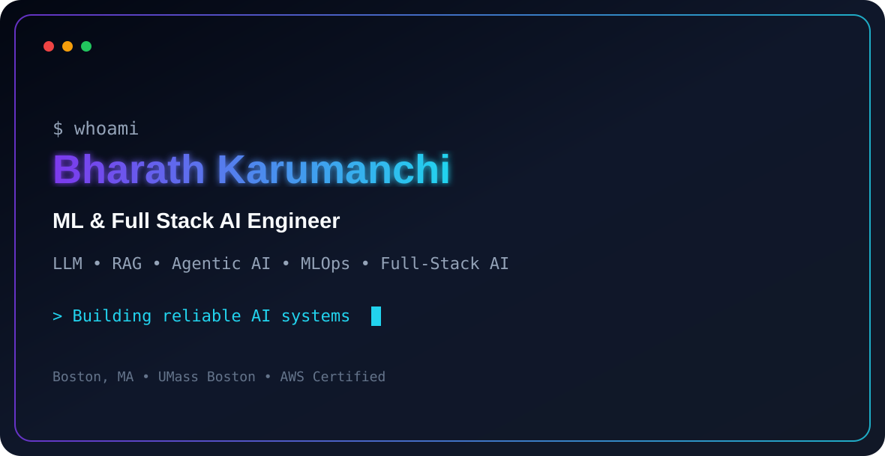

<!-- ====================================================== -->
<!--            BHARATH KARUMANCHI — GITHUB PROFILE         -->
<!-- ====================================================== -->

<p align="center">
  <picture>
    <source
      media="(prefers-color-scheme: dark)"
      srcset="./assets/dark.svg"
    />
    <source
      media="(prefers-color-scheme: light)"
      srcset="./assets/light.svg"
    />
    
  </picture>
</p>

<h1 align="center">
  Hi 👋, I'm Bharath Karumanchi
</h1>

<h3 align="center">
  ML & Full Stack AI Engineer
</h3>

<p align="center">
  LLM Systems • RAG • Agentic AI • Multimodal AI • MLOps • Full-Stack AI
</p>

<p align="center">
  
</p>

<p align="center">
  <a href="https://www.bharathkarumanchi.com/">
    
  </a>

  <a href="https://www.linkedin.com/in/bharath-karumanchi-1221b5300/">
    
  </a>

  <a href="https://github.com/bharath021">
    
  </a>

  <a href="mailto:B.Karumanchi001@umb.edu">
    
  </a>
</p>

---

## 🚀 About Me

I am an **ML & Full Stack AI Engineer** focused on building and deploying reliable, production-grade artificial intelligence systems.

My work combines:

- Large language model applications
- Retrieval-augmented generation systems
- Agentic AI workflows
- Multimodal document intelligence
- LLM evaluation and observability
- Full-stack product engineering
- Cloud-native deployment
- Open-source software development

I build end-to-end AI products using **Python, TypeScript, React, Next.js, FastAPI, LangChain, LlamaIndex, Claude API, OpenAI API, vector databases, and AWS**.

My recent engineering work includes an LLM-powered API scaffolding platform that:

- Reduced engineering setup time from **2.4 hours to 40 minutes**
- Automatically resolved approximately **80% of schema failures**
- Reduced LLM token usage by **20%**
- Detected three silent pipeline failures before production impact
- Combined a React and TypeScript frontend with a Python and FastAPI backend

### Professional Snapshot

- 🎓 M.S. in Computer Science — University of Massachusetts Boston
- 📍 Based in Boston, Massachusetts
- 🤖 Claude Certified Architect
- ☁️ AWS Certified AI Practitioner
- 💻 AWS Certified Developer – Associate
- 🚀 Focused on AI Engineering, Agentic Systems, RAG, MLOps and Applied AI
- 🌍 Open-source contributor across distributed systems and cloud infrastructure

---

## 🎯 Current Focus

```text
Building reliable multi-agent AI systems
Designing enterprise RAG architectures
Improving LLM evaluation and observability
Developing multimodal document intelligence platforms
Shipping full-stack AI SaaS products
Optimizing AI systems for production
Contributing to production open-source projects
```

---

## 🧠 Core Expertise

<table>
<tr>
<td width="50%" valign="top">

### 🤖 AI Engineering

- Large language model applications
- Agentic AI workflows
- Tool calling and function execution
- Structured output generation
- Prompt engineering
- Self-correction loops
- LLM inference optimization
- Fine-tuning and RLHF
- Model evaluation
- LLMOps and MLOps

</td>

<td width="50%" valign="top">

### 📚 Retrieval & Multimodal AI

- Retrieval-augmented generation
- Document ingestion pipelines
- Embedding generation
- Vector databases
- Hybrid retrieval
- Semantic search
- Re-ranking
- Vision API integration
- OCR pipelines
- Speech and NLP systems

</td>
</tr>

<tr>
<td width="50%" valign="top">

### 💻 Full-Stack AI

- React and Next.js interfaces
- TypeScript applications
- FastAPI backend services
- REST and GraphQL APIs
- Authentication and authorization
- Subscription billing
- Responsive user interfaces
- Production SaaS architecture

</td>

<td width="50%" valign="top">

### ☁️ Cloud & Infrastructure

- AWS cloud deployment
- Docker containerization
- Kubernetes orchestration
- Terraform infrastructure
- GitHub Actions CI/CD
- Prometheus monitoring
- Grafana dashboards
- Distributed systems

</td>
</tr>
</table>

---

# 🛠️ Tech Stack & Skills

<details open>
<summary><b>🤖 AI, LLMs & Agentic Systems</b></summary>

<br>


</details>

<details>
<summary><b>🧠 Machine Learning & Deep Learning</b></summary>

<br>


</details>

<details>
<summary><b>📚 Retrieval, Vector Search & NLP</b></summary>

<br>


</details>

<details>
<summary><b>👁️ Multimodal & Document AI</b></summary>

<br>


</details>

<details>
<summary><b>💻 Full-Stack Development</b></summary>

<br>


</details>

<details>
<summary><b>🗄️ Backend, Databases & Data Engineering</b></summary>

<br>


</details>

<details>
<summary><b>☁️ Cloud, DevOps & Infrastructure</b></summary>

<br>


</details>

<details>
<summary><b>🧪 Testing, Quality & Engineering Practices</b></summary>

<br>


</details>

---

# 💼 Professional Experience

## 🤖 ML & Full Stack Engineer Intern

**Codec Technologies**  
May 2025 – October 2025 · Remote

### API Scaffolding Agent

Designed and deployed an LLM-powered internal developer productivity platform using Claude API, OpenAI API, FastAPI, React and TypeScript.

- Reduced API setup time from **2.4 hours to 40 minutes**
- Built a multi-stage agentic pipeline that reads OpenAPI specifications
- Generated production-ready API boilerplate automatically
- Added Pydantic validation between every LLM inference stage
- Built a self-correction loop that resolved approximately **80% of schema failures**
- Reduced token usage by **20%**
- Created prompt versioning and structured error handling
- Built Prometheus and Grafana observability dashboards
- Detected three silent production failures
- Deployed the system on AWS using GitHub Actions CI/CD

---

## 🎓 Teaching Assistant — AI, ML & Algorithms

**University of Massachusetts Boston**  
May 2024 – April 2025 · Boston, Massachusetts

- Supported more than **60 graduate students**
- Conducted Python labs covering AI, ML, deep learning and NLP
- Guided students through PyTorch model training
- Taught embeddings, vector search and LLM application development
- Reviewed ML implementations and data-pipeline architectures
- Provided code-review-style feedback on algorithms and software design
- Supported distributed systems and advanced algorithms coursework

---

# 🏆 Featured AI Projects

<table>
<tr>
<td width="50%" valign="top">

## ⚙️ API Scaffolding Agent

**Claude API • OpenAI API • FastAPI • React • TypeScript • AWS**

An agentic developer platform that reads OpenAPI specifications and generates production-ready API boilerplate.

### Key Features

- Multi-step agentic pipeline
- Structured output validation
- Automatic error correction
- Prompt version control
- LLM observability
- Token usage optimization
- AWS deployment

</td>

<td width="50%" valign="top">

## 🤖 Autonomous Coding Assistant

**Claude • GPT-4 • GitHub API • Python • Tool Calling**

An autonomous AI coding agent that reads GitHub issues, writes code, executes tests and opens pull requests.

### Key Features

- Multi-step agent loops
- GitHub API integration
- Automated code generation
- Test execution
- Retry and recovery logic
- Self-verification
- Structured output validation

[View GitHub Profile](https://github.com/bharath021)

</td>
</tr>

<tr>
<td width="50%" valign="top">

## 📚 Personal Knowledge Base Chatbot

**RAG • LangChain • LlamaIndex • ChromaDB • FastAPI • React**

A RAG-powered knowledge assistant that ingests PDFs, documents and notes and returns grounded answers with citations.

### Key Features

- Document ingestion
- Intelligent text chunking
- OpenAI embeddings
- Vector storage
- Hybrid retrieval
- Re-ranking
- Context-window management
- Source citations

[View GitHub Profile](https://github.com/bharath021)

</td>

<td width="50%" valign="top">

## 📄 AI Resume Reviewer

**Next.js • TypeScript • OpenAI • Supabase • Stripe • Vercel**

A deployed AI SaaS application that analyzes resumes and provides structured scoring and improvement recommendations.

### Key Features

- AI-powered resume analysis
- Structured scoring
- Improvement recommendations
- Supabase authentication
- Stripe subscriptions
- Usage-based rate limits
- Production deployment

[View GitHub Profile](https://github.com/bharath021)

</td>
</tr>

<tr>
<td width="50%" valign="top">

## 📊 Model Evaluation Dashboard

**Python • React • PostgreSQL • Recharts • LLM Evals**

A production-focused evaluation platform for comparing GPT, Claude and Llama outputs on common prompts.

### Key Features

- Multi-model comparison
- BLEU and ROUGE evaluation
- Semantic similarity
- Custom rubric-based scoring
- Prompt version registry
- Quality tracking
- Regression detection
- Interactive visualizations

[View GitHub Profile](https://github.com/bharath021)

</td>

<td width="50%" valign="top">

## 👁️ Document Intelligence Platform

**Vision API • OCR • FastAPI • React • Node.js • Pydantic**

A multimodal AI application that extracts structured information from PDFs, receipts, invoices and medical documents.

### Key Features

- Vision API integration
- OCR processing
- Table extraction
- Structured JSON output
- Pydantic schema validation
- Confidence scoring
- Excel export
- Graceful fallback handling

[View GitHub Profile](https://github.com/bharath021)

</td>
</tr>
</table>

<p align="center">
  <a href="https://github.com/bharath021?tab=repositories">
    
  </a>
</p>

---

# 🌍 Open-Source Engineering

<table>
<tr>
<td width="50%" valign="top">

## Apache Kafka

- Contributed a Java optimization to Kafka’s distributed stream-processing layer
- Added JUnit test coverage
- Worked through production-grade maintainer reviews
- Navigated a large open-source codebase independently

</td>

<td width="50%" valign="top">

## Kubernetes

- Contributed to a custom metrics API
- Supported Prometheus and Grafana integration
- Enabled SLO-based autoscaling
- Focused on containerized machine-learning workloads

</td>
</tr>
</table>

---

# 📈 Engineering Impact

<table>
<tr>
<td width="25%" align="center">

## 40%

Reduction in engineering setup time

</td>

<td width="25%" align="center">

## 80%

Schema failures resolved automatically

</td>

<td width="25%" align="center">

## 20%

Reduction in LLM token usage

</td>

<td width="25%" align="center">

## 3

Silent failures detected before impact

</td>
</tr>
</table>

---

# 🎓 Education

## Master of Science in Computer Science

**University of Massachusetts Boston**  
Boston, Massachusetts  
January 2024 – December 2025

- **GPA:** 3.7 / 4.0
- **Focus:** AI Engineering, Machine Learning, Distributed Systems and Software Engineering

### Relevant Coursework

Artificial Intelligence, Machine Learning, Applied Machine Learning, Deep Learning, Natural Language Processing, Distributed Systems, Advanced Algorithms, Database Systems, Cloud Computing, Cybersecurity, Software Engineering and Object-Oriented Design.

---

## Bachelor of Engineering in Computer Science

**Jawaharlal Nehru Technological University**  
India  
August 2018 – June 2022

### Relevant Coursework

Data Structures and Algorithms, Web Technologies, Database Management Systems, Software Testing, Distributed Systems, Object-Oriented Programming and Computer Networks.

---

# 📚 Graduate Coursework

<details open>
<summary><b>🤖 Artificial Intelligence & Machine Learning</b></summary>

<br>

| Course Code | Course Name | Grade | Key Topics |
|---|---|---|---|
| **CS 670** | Artificial Intelligence | A | Search algorithms, knowledge representation, expert systems and neural networks |
| **CS 671** | Machine Learning | A | Supervised learning, unsupervised learning, deep learning, model evaluation and feature engineering |
| **CS 638** | Applied Machine Learning | A | Real-world ML applications, data preprocessing, model deployment and production ML |

</details>

<details>
<summary><b>🔐 Security & Cryptography</b></summary>

<br>

| Course Code | Course Name | Grade | Key Topics |
|---|---|---|---|
| **CS 613** | Applied Cryptography | A | Encryption algorithms, public-key cryptography, digital signatures and blockchain security |
| **CS 642** | Cybersecurity in IoT | A | IoT security protocols, network security, threat modeling and secure device communication |

</details>

<details>
<summary><b>💾 Database Systems & Development</b></summary>

<br>

| Course Code | Course Name | Grade | Key Topics |
|---|---|---|---|
| **CS 630** | Database Management Systems | A | Relational databases, SQL, normalization, transactions and query optimization |
| **CS 636** | Database Application Development | A | Database design, stored procedures, triggers and application integration |
| **CS 637** | Database-Backed Websites | A | Web-database integration, ORMs, REST APIs and full-stack development |

</details>

<details>
<summary><b>💻 Software Engineering & Development</b></summary>

<br>

| Course Code | Course Name | Grade | Key Topics |
|---|---|---|---|
| **CS 680** | Object-Oriented Design & Programming | A | OOP principles, design patterns, SOLID principles and UML |
| **CS 681** | Object-Oriented Software Development | A | Software architecture, Agile methodologies, code quality and refactoring |
| **CS 682** | Software Development Laboratory I | A | Team development, version control, testing, collaboration and CI/CD |

</details>

<details>
<summary><b>⚙️ Theory, Algorithms & Computer Science Foundations</b></summary>

<br>

| Course Code | Course Name | Grade | Key Topics |
|---|---|---|---|
| **CS 620** | Theory of Computation | A | Automata theory, Turing machines, computability and complexity classes |
| **CS 622** | Theory of Formal Languages | A | Regular languages, context-free grammars, parsing and language hierarchies |
| **CS 624** | Analysis of Algorithms | A | Algorithm design, time and space complexity, dynamic programming and graph algorithms |
| **CS 651** | Compiler Design | A | Lexical analysis, parsing, code generation and compiler optimization |

</details>

<details>
<summary><b>🎨 Design & User Experience</b></summary>

<br>

| Course Code | Course Name | Grade | Key Topics |
|---|---|---|---|
| **CS 615** | User Interface Design | A | UI/UX principles, human-computer interaction, prototyping and usability testing |

</details>

<p align="center">
  

  

  
</p>

---

# 🏅 Certifications

<table>
<tr>
<td width="50%" valign="top">

## AI & LLM Certifications

- **Claude Certified Architect — Anthropic**
- **Building with the Claude API — Anthropic**
- **AI Fluency Framework & Foundations — Anthropic**
- **Building Systems with the ChatGPT API — DeepLearning.AI**
- **Generative AI Fundamentals — Databricks**
- **Introduction to Artificial Intelligence — IBM**

</td>

<td width="50%" valign="top">

## AWS Certifications

- **AWS Certified AI Practitioner**
- **AWS Certified Developer – Associate**

### Core Areas

- AWS AI services
- Responsible AI
- EC2
- S3
- Lambda
- RDS
- CloudWatch

</td>
</tr>
</table>

---

# 📊 GitHub Analytics

<p align="center">
  

  
</p>

<p align="center">
  
</p>

---

# 🐍 Contribution Activity

<p align="center">
  
</p>

---

# 🎯 2026 Engineering Goals

- [ ] Ship five production-grade AI applications
- [ ] Build an enterprise multi-agent AI platform
- [ ] Contribute to ten meaningful open-source projects
- [ ] Publish technical articles about agents, RAG and LLM evaluation
- [ ] Improve expertise in distributed AI and ML infrastructure
- [ ] Mentor students and early-career AI engineers
- [ ] Speak at AI engineering meetups or technical conferences

---

# 🌐 Connect With Me

<p align="center">
  <a href="https://www.bharathkarumanchi.com/">
    
  </a>

  <a href="https://www.linkedin.com/in/bharath-karumanchi-1221b5300/">
    
  </a>

  <a href="https://github.com/bharath021">
    
  </a>

  <a href="mailto:B.Karumanchi001@umb.edu">
    
  </a>
</p>

---

<p align="center">
  
</p>

<h3 align="center">
  Building reliable AI systems that move from prototype to production.
</h3>

<p align="center">
  <i>Engineer the system. Measure the output. Improve the intelligence.</i>
</p>
